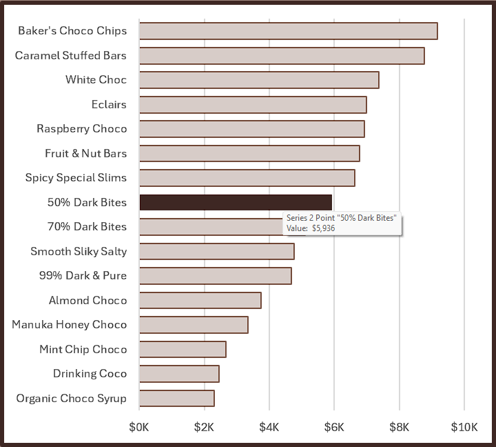
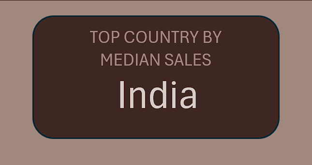

# Excel Chocolate Sales 2022 Dashboard


## Introduction

The `Chocolate Sales 2022 Dashboard` provides a clear and insightful overview of sales performance throughout the year, helping businesses quickly identify trends, peak sales periods, and underperforming months.

The data contains detailed information on the Sales Person, Product Name, Sales Region, Boxes Shipped, and Revenue/Amount that are presented here.

### Dashboard File
My final dashboard is in [Chocolate_sales.xlsx](Chocolate_sales.xlsx) .

### Chocolate Sales Dataset

The dataset used for this project contains real-world chocolate sales data from 2022. The data is from Kaggle, here is the link [https://www.kaggle.com](https://www.kaggle.com/datasets/atharvasoundankar/chocolate-sales). It includes detailed information on:

- **Sales Person**
- **Country**
- **Product**
- **Date**
- **Amount/Revenue**
- **Boxes Shipped**

### Excel Skills Used

The following Excel skills were utilized for analysis:

- **Power Query**
- **Charts**
- **Formulas and Functions**
- **Data Validation**

### Power Query


- **Usage:** `(ETL)` Utilized power query to extract csv file from kaggle, then transform data by adding month column, and lastly load data into excel. Also check if there is duplicate datas for data cleaning purpose.

## Dashboard Build

### Charts

#### Chocolate Median Sales - Bar Chart



- **Excel Features:** Utilized bar chart feature (with formatted Amount/Revenue values) and optimized layout for clarity.
- **Design Choice:** Horizontal bar chart for visual comparison of median Amount/Revenues.
- **Data Organization:** Sorted chocolate products by descending median amount for improved readability.
- **Insights Gained:** This identifies which chocolate has the highest median amount/revenue.

#### Country Median Sales - Pie Chart


- **Excel Features:** Utilized Pie chart feature to plot median amount/revenue globally, and optimized layout for clarity.
- **Design Choice:** 2D pie chart to visually differentiate revenue across regions.
- **Data Representation:** Plotted median revenue for each country with available data.
- **Insights Gained:** Enables quick grasp of global revenue disparities and highlights high/low revenue regions.

#### Monthly Median Sales - Column Chart


- **Excel Features:** Utilized Column chart feature to plot median amount/revenue monthly, and optimized layout for clarity.
- **Design Choice:** Clustered column chart to compare monthly revenue.
- **Data Representation:** Plotted median revenue monthly with available data.
- **Insights Gained:** easily identify which months had the highest and lowest revenue.

### Formulas and Functions

#### Median Amount/Revenue by products, country, month

```
=MEDIAN(IF((Chocolate_Sales[Product]=B3)*(Chocolate_Sales[Amount]<>0)*(Chocolate_Sales[Country]=country)*(Chocolate_Sales[Month]=month),Chocolate_Sales[Amount]))
```

```
=MEDIAN(IF((Chocolate_Sales[Country]=B3)*(Chocolate_Sales[Amount]<>0)*(Chocolate_Sales[Product]=product)*(Chocolate_Sales[Month]=month),Chocolate_Sales[Amount]))
```

```
=MEDIAN(IF((Chocolate_Sales[Month]=B3)*(Chocolate_Sales[Amount]<>0)*(Chocolate_Sales[Product]=product)*(Chocolate_Sales[Country]=country),Chocolate_Sales[Amount]))
```

- **Multi-Criteria Filtering:** Checks product, country, month, and excludes blank amount.
- **Array Formula:** Utilizes `MEDIAN()` function with nested `IF()` statement to analyze an array.
- **Tailored Insights:** Provides specific amount information for product, country, and month.
- **Formula Purpose:** This formula populates the table below, returning the median amount based on product, country, and month specified.


#### Background Table

  

### KPIs

#### KPI#1 Total Revenue

```
=SUM(IF((Chocolate_Sales[Country]=country)*(Chocolate_Sales[Product]=product)*(Chocolate_Sales[Month]=month),Chocolate_Sales[Amount]))
```

- **Multi-Criteria Filtering:** Returns the sum of amount depending on the validation of `Product`, `Country`, and `Month`.
- **Formula Purpose:** This formula calculates the sum of amount depending on validation. Also serves as one of the KPI.

#### Background Table & KPI Implementation


#### KPI#2 Top country by median sales

- **Formula:** The formula used in this KPI is the same formula used in calculating the median amount of country. Returns the country with highest median amount that Depends on validation of `Product` and `Month`.
- **Purpose:** To determine which country has the highest Revenue.

#### Background Table & KPI Implementation




#### KPI#3 Total Boxes Shipped

```
=SUM(IF((Chocolate_Sales[Country]=country)*(Chocolate_Sales[Boxes Shipped]<>0)*(Chocolate_Sales[Product]=product)*(Chocolate_Sales[Month]=month),Chocolate_Sales[Boxes Shipped]))
```

- **Multi-Criteria Filtering:** Returns the sum of boxes shipped depending on the validation of `Product`, `Country`, and `Month`.
- **Formula Purpose:** This formula calculates the sum of boxes shipped depending on validation. Also serves as one of the KPI.

#### Background Table & KPI Implementation


### Data Validation

#### Filtered List

- **Enhanced Data Validation:** Implementing the filtered list as a data validation rule under the `Product`, `Country`, and `Month` option in the Data tab ensures:
    - User input is restricted to predefined, validated datas
    - Incorrect or inconsistent entries are prevented
    - Overall usability of the dashboard is enhanced


## Conclusion

This Chocolate Sales Year 2022 dashboard provides a clear overview of product performance, regional sales distribution, and monthly revenue trends. It was created to help businesses quickly identify top-performing products, recognize leading markets, and track seasonal revenue fluctuations. By visualizing key metrics such as total revenue, top-median countries, and shipment volume, the dashboard supports data-driven decisions for marketing, inventory, and strategic planning.